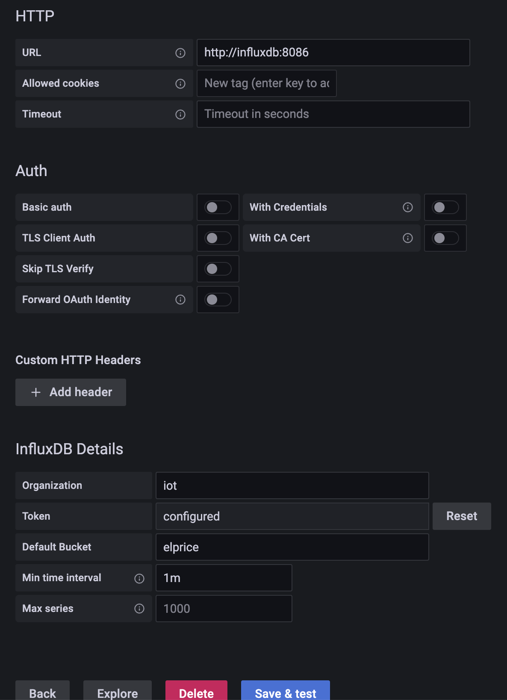
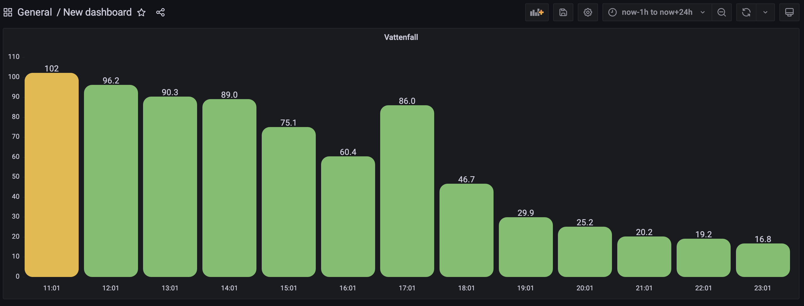

# Vattenfall to InfluxDB exporter

This is a simple exporter that scrapes the Vattenfall API and exports the prices to InfluxDB. It fetches the prices for the previous  24h and next 24h.


## Usage with Docker compose

Docker-compose snippet:
```yaml
version: '3.8'
services:
  influxdb:
    image: influxdb:2.5
    environment:
      DOCKER_INFLUXDB_INIT_MODE: setup
      DOCKER_INFLUXDB_INIT_USERNAME: admin
      DOCKER_INFLUXDB_INIT_PASSWORD: some_password
      DOCKER_INFLUXDB_INIT_ADMIN_TOKEN: some_password
      DOCKER_INFLUXDB_INIT_ORG: iot
      DOCKER_INFLUXDB_INIT_BUCKET: elprice
    ports:
      - '127.0.0.1:8086:8086'

  grafana:
    image: grafana/grafana:9.2.4
    depends_on:
      - influxdb
    links:
      - influxdb
    ports:
      - '127.0.0.1:3000:3000'

  renderer:
    image: grafana/grafana-image-renderer:latest
    ports:
      - 8081

  vattenfall:
    image: rvoitenko/vattenfall-to-influxdb:0.0.1
    environment:
      INFLUXDB_URL: 'http://influxdb:8086'
      INFLUXDB_TOKEN: 'some_password'
      INFLUXDB_BUCKET: 'elprice'
      INFLUXDB_ORG: 'iot'
```

Then you add InfluxDB as a datasource in Grafana(choose Flux as query language):



Add a new panel and run the following query against the `InfluxDB` datasource:

```flux
from(bucket: "elprice")
  |> range(start: v.timeRangeStart, stop: v.timeRangeStop)
  |> filter(fn: (r) => r["_measurement"] == "current")
  |> aggregateWindow(every: v.windowPeriod, fn: mean, createEmpty: false)
  |> yield(name: "last")
```

Here is an example of the Grafana bar chart panel(works best with time range from ´now-1h´ to ´now+24h´, so it will show the data from the current hour to 24 hours ahead):


